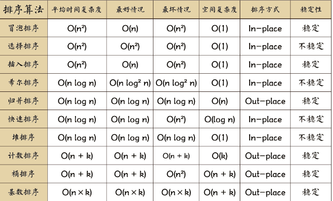

>图来源: https://mp.weixin.qq.com/s/vn3KiV-ez79FmbZ36SX9lg

看这篇文章就可以了：
https://mp.weixin.qq.com/s/vn3KiV-ez79FmbZ36SX9lg

# 归并排序
归并排序 分为 自顶向下 和 自底向上 两种

# 快排
```c++
void partion(vector<int>& nums, int left, int right) {
    int pivot = nums[left]; // 选择第一个元素作为轴点
    while(left < right) { //从两边向中间进行扫描
        while(left <right && pivot <= nums[right]) {
            right --;
        }
        nums[ left ] = nums[ right ];
        while(left <right && nums[let] <= pivot ) {
            left ++;
        }
        nums[right] = nums[left];
    }
    nums[left] = pivot;
    return left;
}
void quickSort(vector<int>& nums, int left , int right) {
    if( right - left < 2 ) return; // 单元素有序
    int mid = partion(nums, left, right -1); // 分割,找到轴点

    quickSort(nums, lo, mid);
    quickSort(nums, mid + 1 , hi);

    return;
}
```